# Data Flow Diagram: AI-Enabled Photonic Radar System

This document contains the Data Flow Diagram (DFD) for the AI-Enabled Photonic Radar System, illustrating the interaction between external entities, system processes, and data stores.

```mermaid
graph TD
    %% Define Styles
    classDef entity fill:#e1ecf4,stroke:#3b82f6,stroke-width:2px,color:#1e3a8a
    classDef process fill:#ffffff,stroke:#0f172a,stroke-width:1px,color:#0f172a
    classDef store fill:#f1f5f9,stroke:#64748b,stroke-width:2px,stroke-dasharray: 5 5,color:#334155

    %% External Entities
    Operator[Radar Operator]:::entity
    Target[Target Environment]:::entity

    %% Processes
    Gen[Photonic Radar Signal\nGeneration]:::process
    Tx[Signal Transmission]:::process
    Rx[Target Reflection &\nEcho Reception]:::process
    DSP[Photonic Signal Processing]:::process
    TF[Time–Frequency Analysis &\nFeature Extraction]:::process
    AI[AI-Based Target Detection &\nClassification]:::process
    Decision[Decision Making &\nVisualization]:::process

    %% Data Stores
    StoreParams[(Radar Signal\nParameters)]:::store
    StoreDB[(Processed Signal\nDatabase)]:::store
    StoreAI[(AI Model &\nTraining Data)]:::store
    StoreLog[(Detection Results\nLog)]:::store

    %% Data Flows
    %% 1. Operator Control
    Operator -->|Control Parameters| Gen

    %% 2. Signal Generation and Parameter Access
    StoreParams -.-> Gen
    Gen -->|Radar Waveforms| Tx

    %% 3. Transmission to Environment (Implicit physical link)
    Tx -.-> Target

    %% 4. Reflection and Reception
    Target -->|Reflected Echo Signals| Rx
    Rx -->|Raw Echo Data| DSP

    %% 5. Signal Processing
    DSP -->|Processed Signals| TF
    DSP -.->|Archiving| StoreDB

    %% 6. Feature Extraction & AI Analysis
    TF -->|Feature Data| AI
    StoreAI -.->|Model Weights| AI

    %% 7. Decision & Output
    AI -->|Detection Results| Decision
    Decision -.->|Logging| StoreLog
    Decision -->|Visual Outputs and Alerts| Operator
```

