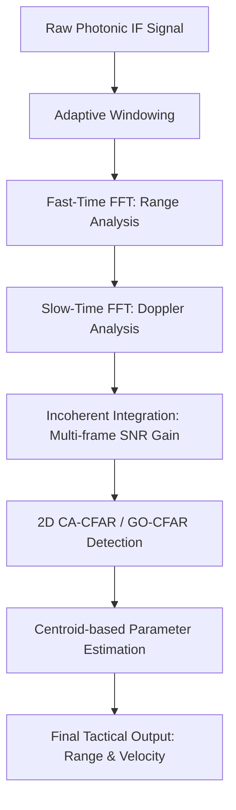

# Radar Signal Processing Flow: Realistic System Analysis

This document explains the mathematical foundation and operational flow of the upgraded radar signal processing pipeline in the **PHOENIX-RADAR** project.

## 1. Tactical Processing Chain

## 2. Mathematical Justification

### 2.1. Adaptive FFT Windowing
To suppress sidelobes and improve target dynamic range, we use window functions $w[n]$.
- **Dolph-Chebyshev Window**: Minimizes the main-lobe width for a given peak sidelobe level (PSL).
- **Taylor Window**: Provides low sidelobes with a decay rate that reduces target masking.
Improving sidelobe control ensures that small targets (e.g., Drones) are not buried by the sidelobes of large targets (e.g., Aircraft).

### 2.2. Clutter Modeling (Weibull & K-Distribution)
Real-world radar clutter is non-Gaussian.
- **Weibull PDF**: $f(x) = \frac{k}{\lambda} (\frac{x}{\lambda})^{k-1} e^{-(x/\lambda)^k}$.
- **K-Distribution**: A compound model combining Gamma-distributed texture with Rayleigh-distributed speckle, accurately representing high-resolution sea clutter.
Accurate clutter modeling allows the AI to learn distinguishing signatures of tactical targets vs environmental background.

### 2.3. CA-CFAR Detection
The Cell-Averaging Constant False Alarm Rate (CA-CFAR) detector sets a local threshold $T$:
$$T = \alpha \cdot \frac{1}{N} \sum_{i \in \text{Training}} P_i$$
Where $\alpha$ is the threshold multiplier calculated from the desired probability of false alarm $P_{fa}$:
$$\alpha = N(P_{fa}^{-1/N} - 1)$$
This ensures the radar maintains a stable detection rate even as the background noise level fluctuates.

### 2.4. Range & Doppler Mapping
We map FFT bin indices $(k_r, k_d)$ to physical SI units:
- **Range ($R$)**: $R = \frac{c \cdot k_r \cdot \Delta f_{bin}}{2 \cdot S}$ where $S = \text{Chirp Slope}$.
- **Velocity ($v$)**: $v = \frac{\lambda \cdot \Delta f_d \cdot (k_d - N_d/2)}{2}$ where $\lambda$ is the carrier wavelength.

## 3. Performance Enhancements
1. **Detection Accuracy**: Multi-frame integration increases the SNR by approximately $\sqrt{N}$ frames, allowing for longer detection ranges.
2. **Robustness**: Adaptive windowing prevents "blind spots" caused by sidelobe leakage.
3. **Clutter Rejection**: GO-CFAR suppresses false positives at clutter edges, improving reliability in complex environments like coastlines or urban centers.
